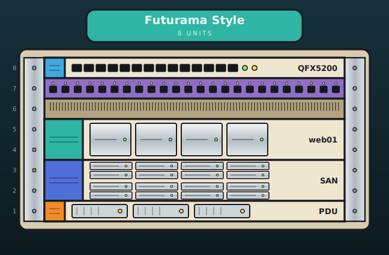
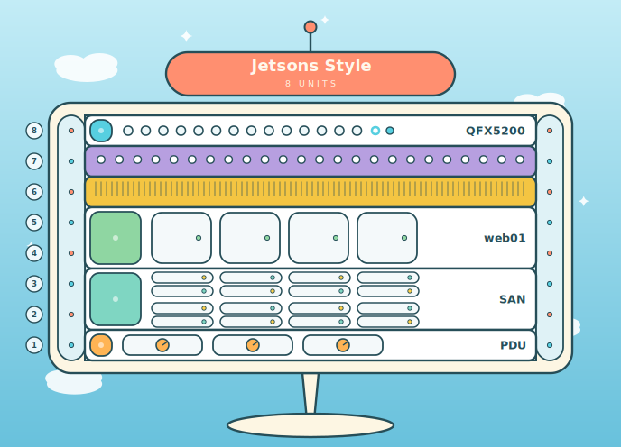
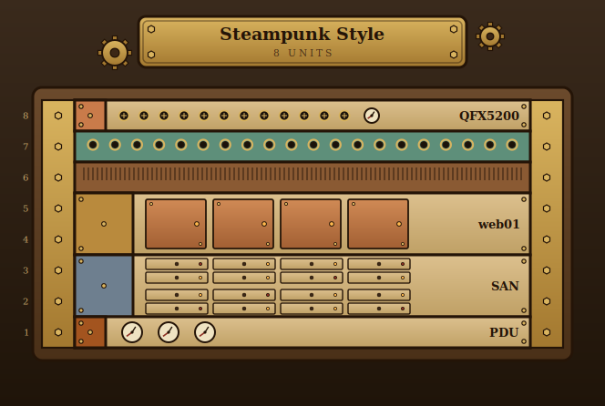
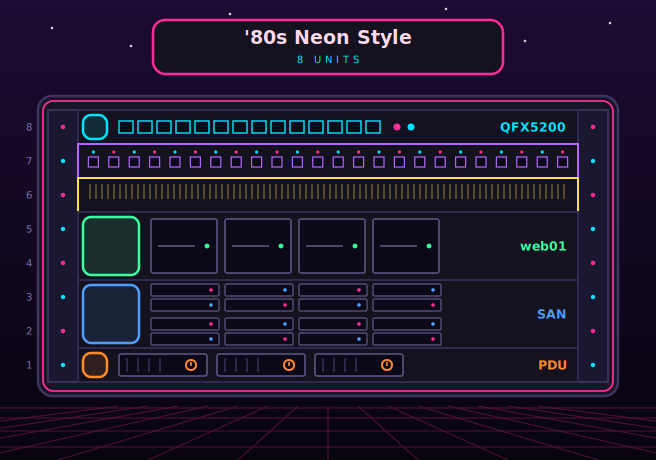

# RackfaceViz

Stylized server-rack face diagrams as SVG — fully static, rendered entirely in the browser. Design a rack in the visual editor, share it as a URL, embed it in a wiki, or download the SVG.

**Live: [jimmydigital.github.io/RackViz/src](https://jimmydigital.github.io/RackViz/src/)** — jump straight to the [editor](https://jimmydigital.github.io/RackViz/src/editor.html).

| Futurama (default) | Jetsons | Steampunk | '80s Neon |
|---|---|---|---|
|  |  |  |  |

## Features

- **Zero backend** — plain HTML/CSS/JS ES modules, no build step, serve from any static host
- **Visual editor** with drag-and-drop reordering, live preview, shareable URLs, and SVG download; edit rows scale with device height so the list mirrors the rendered rack
- **Four visual styles** (Futurama, Jetsons, Steampunk, '80s Neon) and seven color palettes — any palette works with any style
- **Ten device kinds** (switch, server, storage, patch, power, …) with per-device color overrides
- **URL-driven rendering** — a rack is just a query string, ideal for iframe embedding in wikis
- **CSP-friendly** — no inline scripts or styles

## Quick Start

Use the [hosted version](https://jimmydigital.github.io/RackViz/src/), or run it locally:

```sh
cd src
python3 -m http.server 8000
# open http://localhost:8000/editor.html
```

Any static file server works; there is nothing to build or install.

## Usage

### Editor

Open `editor.html`, set rack size/title/style, and edit rows: label, device type, color, and U height. Duplicate (⧉), remove (✕), or drag (☰) rows to rearrange. The output section gives you the items string and a shareable `render.html` URL; the preview panel has an SVG download button.

### Render URL

`render.html` draws a rack from query parameters:

```
render.html?items=QFX5200:1:switch|Patch%20Panel:2:patch|web01:2:server&size=8&title=My%20Rack&style=jetsons
```

| Param | Required | Description |
|---|---|---|
| `items` | yes | Pipe-separated device list (format below) |
| `size` | no | Rack size in U, 1–60 (default 42) |
| `title` | no | Header plaque text |
| `style` | no | `futurama` (default), `jetsons`, `steampunk`, `eighties` |
| `palette` | no | `futurama`, `jetsons`, `steampunk`, `eighties`, `mono`, `pastel`, `highcontrast` — defaults to the style's matching palette |
| `colors` | no | Comma-separated `kind=hexcolor` overrides applied on top of the palette |

### Item format

`label:u_height:kind[:color]`, joined with `|`. Labels may be empty; percent-encode `%`, `|`, `:`, `&` inside them. `color` is an optional 6-char hex (no `#`) overriding that device's accent in any style.

| Kind | Renders as | Aliases |
|---|---|---|
| `blank` | Blank panel | |
| `patch` | Patch panel, one port row per U | |
| `brush` | Brush / cable management | |
| `switch` | Switch with port rows (one per U) and LEDs | `router`, `switch_grn`, `switch_cyn` |
| `appliance` | Appliance with screen | |
| `server` | Server with drive bays | `compute`, `gpu` |
| `storage` | 2.5" drive grid, 4 wide × 2 rows per U | `jbod`, `disk_shelf` |
| `power` | Power shelf with PSU modules | |
| `shelf` | Shelf with rail | |
| `generic` | Generic device | `firewall`, `load_balancer`, `console`, `pdu`, `ups`, `fiber_panel`, `kvm` |

### Embedding

The SVG is generated by JavaScript, so use an iframe (not ``):

```html
<iframe src="https://your-host/render.html?items=web01:2:server&size=4&title=My%20Rack"
        width="700" height="400" style="border:0"></iframe>
```

### SVG → PNG

```sh
# macOS: brew install librsvg   |   Debian/Ubuntu: sudo apt install librsvg2-bin
rsvg-convert -o rack.png rack.svg
rsvg-convert --zoom 2 -o rack@2x.png rack.svg   # 2x resolution
```

Inkscape also works (`inkscape rack.svg --export-type=png -o rack.png`). Avoid ImageMagick's `convert`; its SVG renderer mangles gradients and filters.

## Adding a Style

Styles are self-contained modules behind a registry — no changes to the editor or render pages needed:

1. Create `src/styles/<id>.js` with a default export of `{ id, label, defaultPalette, colors, render(items, options) }` (copy an existing style as a starting point).
2. Add a matching named palette to `PALETTES` in `src/palette.js`.
3. Import the module in `src/styles/index.js` and append it to `STYLES`.

The style dropdown, `style=` URL param, and color dropdowns pick it up automatically. Full details in [`rackviz-spec.md`](rackviz-spec.md).

## Project Layout

```
src/
├── index.html / index.css      Landing page & docs
├── editor.html / .css / .js    Visual WYSIWYG editor
├── render.html / .css          Standalone render page
├── render-app.js               Render page logic
├── renderer.js                 Dispatcher → active style's render()
├── parser.js                   Items string parser / pretty-printer
├── palette.js                  Palettes & device type definitions
└── styles/                     Style modules + registry
rackviz-spec.md                 Full specification
```
